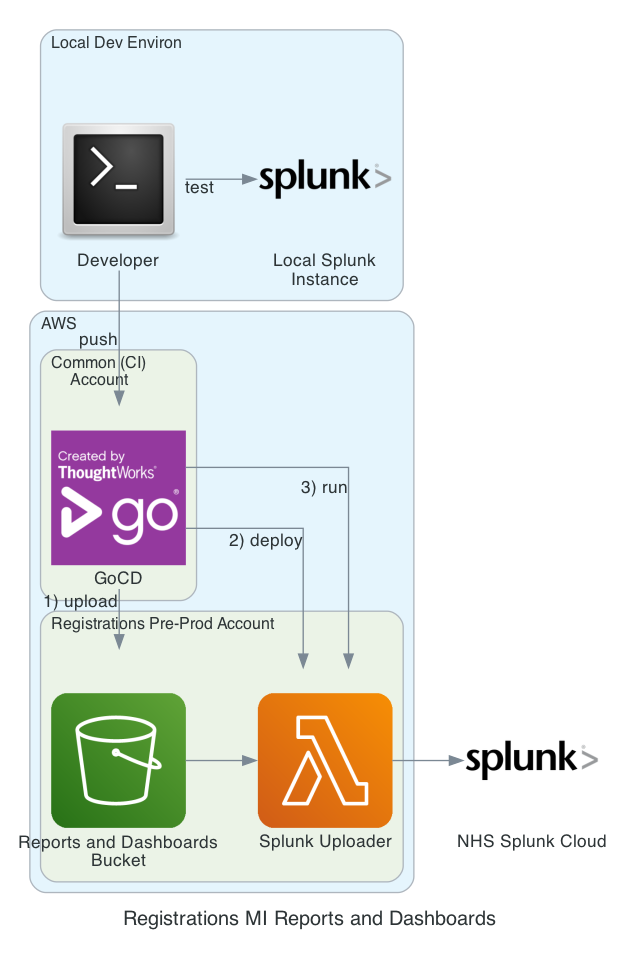

## Prerequisites

- Splunk Enterprise installed
- `pip3 install -r requirements.txt`
- pytest

## Running the report tests ( locally )

```bash
SPLUNK_TOKEN='YOUR_LOCAL_API_TOKEN' SPLUNK_HOST='SPLUNK_HOST' pytest
```

Or

```bash
export SPLUNK_TOKEN='YOUR_LOCAL_API_TOKEN'
pytest
```

## Deploying the reports and dashboards (manually)



> **_NOTE:_** A GOCD pipeline will automatically run and publish to Splunk whenever changes are pushed to the main branch.

This will deploy the "Splunk Uploader" which is a AWS Lambda function designed to push the GP Registrations MI reports and dashboards to NHS Splunk Cloud. The "Splunk Uploader" relies on having the reports and dashboards in an S3 bucket.

### Env Vars

The following env vars are pulled from parameter store.

- `SPLUNK_HOST` the host for splunk, default: localhost:8089
- `SPLUNK_ADMIN_USERNAME` 
- `SPLUNK_APP_ID` the Splunk app to deploy the reports and dashboards to, default: search
- `SPLUNK_TOKEN` the API access token
- `SPLUNK_INDEX` the index to use for all reports and dashboards, default: 'test_index'
- `BUCKET_NAME` the name of the bucket which stores the reports and dashboard data 

### Upload the reports (.splunk) and dashboads (.xml) files to S3
`./tasks upload_data`

### Build and deploy the "Splunk Uploader" lambda
`./tasks build_and_deploy_splunk_uploader_lambda`

### Run the "Splunk Uploader" lambda, this will push the reports and dashboards to NHS Splunk Cloud
`./tasks run_splunk_uploader_lambda`

### Running the lambda locally
`chalice local` 

> **_NOTE:_** due to IP restriction Splunk uploading cannot be done from outside of the Pre-Prod AWS account.

## Managing the Docker image for the CI pipeline

### Prerequisites
- docker buildx

### Updating the Docker image
Only after making changes to the Dockerfile
`./tasks publish_docker`

## MI Api Events
- REGISTRATIONS
- READY_TO_INTEGRATE_STATUSES
- INTEGRATIONS

## Generating synthetic data

Below is an example of generating synthetic data. The result will generate a file called 'synthetic_data.json'.
The data is generating using Faker. At the moment it is fairly random but further work could be done to generate specific data which could cover certain 'scenarios'. e.g. creating a fake "Error 6" situation that could be used to test dashboards and provide training.

**Note:** make sure the number of conversations *-c* is equal to or greater than the number of error points (the other parameters).
i.e. below *-c 7* = 7 conversations. The other parameters total 6.

This data can now be uploaded into Splunk.

```
python3 generate_fake_conversations.py -c 7 -com 1 -reg 1 -req 1 -res 1 -red 1 -int 1      
```